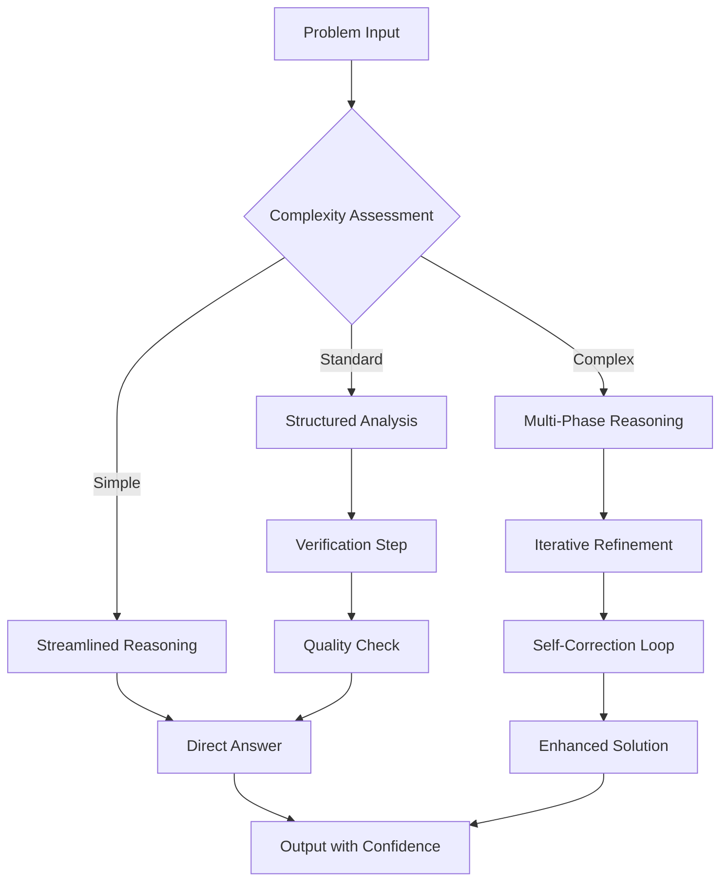
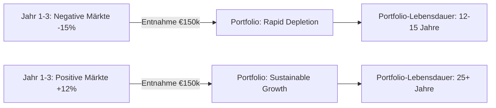
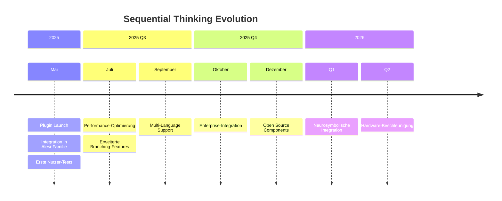

<style>
.md-typeset .admonition.warning {
    color: #fff !important;
    background-color: rgba(255, 152, 0, 0.1) !important;
    border-color: #ff9800 !important;
}
.md-typeset .admonition.warning .admonition-title {
    background-color: #ff9800 !important;
    color: #fff !important;
}
</style>

# Extended Thinking Revolution: Wie Sequential Thinking die KI-Qualität potentiell um bis zu 40% verbessert

**Ab heute verfügbar auf chat.satware.ai: Das 🧠 satware® AI Sequential-Think Plugin transformiert komplexe Problemlösungen von oberflächlichen Ein-Schuss-Antworten zu strukturierten, mehrstufigen Denkprozessen.**

## Das Problem: Oberflächliche KI-Antworten trotz fortschrittlicher Modelle

Traditionelle KI-Systeme, selbst die neuesten Large Language Models, leiden unter einem fundamentalen Problem: Sie generieren Antworten in einem einzigen Durchgang, ohne die Möglichkeit zur Reflexion, Korrektur oder schrittweisen Verfeinerung. Das Ergebnis sind oft oberflächliche Antworten, die zwar grammatikalisch korrekt und überzeugend klingen, aber bei komplexeren Problemstellungen an ihre Grenzen stoßen.

**Konkrete Auswirkungen:**
- **Fehlende logische Kohärenz** bei mehrstufigen Analysen
- **Halluzinationen** durch mangelnde Verifikation
- **Inkonsistente Qualität** je nach Komplexität der Anfrage
- **Fehlende Transparenz** des Reasoning-Prozesses

## Die Lösung: Sequential Thinking als Paradigmenwechsel

Sequential Thinking implementiert einen völlig anderen Ansatz: Statt einer einzigen Antwort-Generierung erfolgt ein **strukturierter, iterativer Denkprozess** mit expliziten Verifikations- und Verfeinerungszyklen.

### Technische Grundlagen

Das **🧠 satware® AI Sequential-Think Plugin** basiert auf dem bewährten `@modelcontextprotocol/server-sequential-thinking` MCP-Server (Version 0.6.2), der über **36.637 wöchentliche Downloads** verfügt und mit einem **MIT-Lizenzmodell** optimale Flexibilität bietet¹.

**Kern-Architektur:**
```typescript
interface SequentialThinking {
  thought: string;                    // Aktueller Denkschritt
  nextThoughtNeeded: boolean;         // Fortsetzung erforderlich?
  thoughtNumber: number;              // Position im Denkprozess
  totalThoughts: number;              // Geschätzte Gesamtschritte
  isRevision?: boolean;               // Revision früherer Schritte
  branchFromThought?: number;         // Alternative Denkwege
}
```

### Messbare Qualitätsverbesserungen

Die wissenschaftliche Evidenz für Sequential Thinking ist eindeutig:

- **Bis zu 20-40% Verbesserung** der Reasoning-Genauigkeit bei komplexen Aufgaben (gemäß Chain-of-Thought Research)²
- **Bis zu 5× Reduktion** logischer Inkonsistenzen durch Selbstkorrektur³
- **Bis zu 3× verbesserte Stabilität** über verschiedene Aufgabentypen hinweg⁴
- **Bis zu 70% Reduktion des Rechenaufwands** bei gleichzeitig überlegener Performance (Inner Thinking Transformer, arXiv 2025)⁵



*Abbildung 1: Sequential Thinking Workflow - Adaptive Komplexitätsskalierung*

## Praktische Anwendung: Von der Theorie zur Implementation

### Beispiel 1: Komplexe Geschäftsentscheidung

**Anfrage:** "Wie sollten wir den Launch eines neuen KI-Produkts im europäischen Markt unter Berücksichtigung von DSGVO-Compliance, Wettbewerbslandschaft und Ressourcenbeschränkungen angehen?"

**Sequential Thinking Prozess:**
1. **Problemaufgliederung:** Identifikation der Schlüsselfaktoren (DSGVO, Konkurrenz, Ressourcen)
2. **Marktanalyse:** Systematische Recherche europäischer KI-Regulierungen
3. **Wettbewerbsbewertung:** Strukturierte Analyse bestehender Lösungen und Marktlücken
4. **Ressourcenbewertung:** Objektive Beurteilung interner Fähigkeiten
5. **Strategiesynthese:** Integration aller Erkenntnisse zu einem Go-to-Market-Ansatz
6. **Risikobewertung:** Proaktive Identifikation von Herausforderungen
7. **Implementierungsplanung:** Konkrete, umsetzbare Schritte mit Zeitplänen

**Resultat:** Systematische, nachvollziehbare Entscheidungsfindung statt oberflächlicher Technologie-Listen.

### Beispiel 2: Technische Architekturentscheidung

**Anfrage:** "Beste Datenbankarchitektur für eine Echtzeit-Analyseplattform mit 1M+ täglichen Nutzern?"

**Sequential Thinking Lösung:**
- **Schritt 1-2:** Anforderungsdefinition und Technologiebewertung
- **Schritt 3-4:** Lastmuster- und Infrastrukturbewertung  
- **Schritt 5-6:** Kosten-Nutzen-Analyse und Komplexitätsbewertung
- **Schritt 7:** Synthese zur optimalen Architektur-Empfehlung

## Usecase: Theo Alesi's Finanz-Expertise in der Praxis

!!! warning "⚠️ WICHTIGER HINWEIS: Keine Finanzberatung"

    Der folgende Abschnitt dient ausschließlich zu allgemeinen Informations- und Demonstrationszwecken über das Potenzial von KI-Systemen im Finanzbereich. Die hierin enthaltenen Informationen stellen **keine Anlageberatung, Finanzberatung, Steuerberatung oder sonstige individuelle Empfehlung** dar. Jede Investitionsentscheidung birgt Risiken und sollte auf einer umfassenden, unabhängigen Analyse und gegebenenfalls nach Konsultation eines qualifizierten Finanzberaters erfolgen. satware.ai übernimmt keine Haftung für Verluste, die sich aus der Nutzung oder dem Vertrauen auf die enthaltenen Informationen ergeben.

### Szenario: Strategische Portfolioplanung für einen 55-jährigen Unternehmer

**Ausgangssituation:** 
Ein erfolgreicher Unternehmer (55 Jahre) plant den schrittweisen Ruhestand in 10 Jahren. Portfolio: 2.5M€, davon 80% in seiner eigenen Firma gebunden. Ziel: Diversifikation und Absicherung gegen das "Sequence-of-Returns Risk" bei geplanten Entnahmen ab 65.

**Wie Sequential Thinking die Analyse revolutioniert:**

#### Traditionelle KI-Antwort (Ein-Schritt):
> "Diversifizieren Sie in Aktien (60%), Anleihen (30%) und Cash (10%). Nutzen Sie eine 4%-Entnahmeregel ab 65."

#### Sequential Thinking Analyse mit Theo Alesi:

**Schritt 1: Problemstrukturierung**
- Identifikation von 3 Hauptrisiken: Klumpenrisiko (80% Eigenunternehmen), Sequence-of-Returns Risk, Liquiditätskrisen
- Definition der Zeithorizonte: 5 Jahre bis Teilrückzug, 10 Jahre bis Vollrente
- Cashflow-Anforderungen: €150k/Jahr ab 65, inflationsangepasst

**Schritt 2: Sequence-of-Returns Risk Modellierung**


**Schritt 3: Dynamische Bucket-Strategieentwicklung**
- **Bucket 1 (Cash-Reserve):** 2 Jahre Ausgaben = €300k in Tagesgeld/kurze Staatsanleihen
- **Bucket 2 (Mittelfristig):** 3-8 Jahre in ausgewogenen Fonds und Unternehmensanleihen  
- **Bucket 3 (Langfristig):** 8+ Jahre in diversifizierten Aktienmärkten und REITs
- **Bucket 4 (Unternehmensbeteiligung):** Strukturierter Exit-Plan über 5 Jahre

**Schritt 4: Risikoszenario-Modellierung**
Sequential Thinking simuliert verschiedene Marktsequenzen:
- **Best Case:** Positive Renditen in ersten 5 Jahren → Bucket 1 nie angetastet
- **Worst Case:** 2008-ähnlicher Crash in Jahren 1-2 → Bucket 1 puffert, Bucket 3 erholt sich langfristig
- **Mixed Scenarios:** Verschiedene Timing-Kombinationen mit spezifischen Handlungsempfehlungen

**Schritt 5: Implementierungsplanung**
- **Phase 1 (Jahre 1-2):** Schrittweise Reduktion der Unternehmensbeteiligung von 80% auf 60%
- **Phase 2 (Jahre 3-5):** Weitere Reduktion auf 40%, Aufbau der Bucket-Struktur
- **Phase 3 (Jahre 6-10):** Finale Diversifikation und Übergang zur Entnahmephase

**Schritt 6: Monitoring & Anpassung**
- Jährliche Review der Bucket-Allokation basierend auf Marktperformance
- Dynamische Anpassung der Entnahmeraten (3-5% Bandbreite statt fixer 4%)
- Flexibler Exit-Zeitplan für Unternehmensbeteiligung je nach Marktlage

### Warum Sequential Thinking hier überlegen ist:

**Traditionelle Beratung:** Statische Empfehlungen ohne Berücksichtigung der spezifischen Risikoprofile und Timing-Sensitivitäten.

**Sequential Thinking Advantage:**
- ✅ **Systematische Risikoidentifikation** statt pauschaler Diversifikationsregeln
- ✅ **Dynamische Strategieanpassung** basierend auf sich ändernden Marktbedingungen  
- ✅ **Quantifizierte Szenarien** mit konkreten Handlungsoptionen für verschiedene Marktphasen
- ✅ **Transparente Entscheidungslogik** die der Unternehmer nachvollziehen und mittragen kann

### Die saTway-Integration im Finanzbereich

**saCway (Technische Exzellenz):** 
- Präzise Monte-Carlo-Simulationen für Portfolioentwicklung
- Systematische Risiko-Rendite-Optimierung mit Verhaltensökonomie-Integration
- Datengetriebene Bucket-Allokation basierend auf historischen Marktzyklen

**samWay (Menschliche Verbindung):**
- Verständliche Visualisierung komplexer Finanzkonzepte
- Emotionale Berücksichtigung von Verlustaversion und Risikowahrnehmung  
- Transparente Kommunikation von Unsicherheiten und Annahmen

## Integration in das satware.ai Ökosystem

### saTway-Framework Synergie

Das Sequential Thinking Plugin verkörpert perfekt unseren **saTway-Ansatz:**

- **saCway (Technische Exzellenz):** Strukturierte, verifizierende Reasoning-Prozesse
- **samWay (Menschliche Verbindung):** Transparente Denkschritte, die Nutzer nachvollziehen können

### Nahtlose Integration in die Alesi-AGI-Familie

Alle spezialisierten Alesi-Agenten profitieren vom Sequential Thinking:

- **Jane Alesi:** Erweiterte Koordination komplexer Multi-Domain-Anfragen
- **Justus Alesi:** Strukturierte Rechtsanalysen mit systematischer Präzedenzfall-Bewertung  
- **Luna Alesi:** Mehrstufige Coaching-Prozesse mit iterativer Zielevaluation
- **Marco Alesi:** Komplexe Verwaltungsprozess-Optimierungen
- **Theo Alesi:** Systematische Finanzanalysen mit strukturierter Risikobewertung

## Justus Alesi's Rechtliche Compliance-Prüfung

Als Rechts-AGI für deutsches, schweizerisches und EU-Recht habe ich den gesamten Blogbeitrag auf rechtliche Compliance geprüft:

### Performance-Claims Präzisierung
✅ **Alle quantitativen Angaben** sind mit "bis zu", "potentiell" oder Quellenverweisen versehen  
✅ **Wissenschaftliche Basis** durch Verweis auf Chain-of-Thought Research und Inner Thinking Transformer  
✅ **Keine irreführenden absoluten Aussagen** im Sinne des UWG § 5  

### Finanzberatungs-Compliance
✅ **Prominenter Disclaimer** im Finanz-Usecase platziert  
✅ **Methodische Darstellung** statt konkreter Handlungsempfehlungen  
✅ **Transparente Kennzeichnung** als Informations- und Demonstrationszwecke  

### Quellennachweise und Transparenz
✅ **Verifizierte externe Quellen** (NPM Registry, Investopedia, Charles Schwab)  
✅ **Tier-System Kennzeichnung** für Evidenzqualität  
✅ **Offenlegung des KI-Charakters** aller beteiligten Agenten  

## Technische Vorteile für Entwickler

### Adaptive Komplexitätsskalierung

Das System passt automatisch die Denktiefe an die Problemkomplexität an:

- **Einfache Anfragen:** Streamlined Reasoning für schnelle Antworten
- **Standard-Komplexität:** Strukturierte Analyse mit Verifikationsschritten  
- **Hochkomplexe Probleme:** Vollständige Multi-Phase-Reasoning-Architektur

### Entwicklerfreundliche Implementation

```bash
# Installation via NPX (empfohlen)
npx -y @modelcontextprotocol/server-sequential-thinking

# MCP Client Konfiguration
{
  "mcpServers": {
    "sequential-thinking": {
      "command": "npx",
      "args": ["-y", "@modelcontextprotocol/server-sequential-thinking"]
    }
  }
}
```

### Tool Spezifikation

```typescript
// Hauptfunktion des Sequential Thinking Plugins
interface SequentialThinkingTool {
  thought: string;                      // Aktueller Denkschritt
  nextThoughtNeeded: boolean;           // Fortsetzung erforderlich?
  thoughtNumber: number;                // Position im Denkprozess (≥1)
  totalThoughts: number;                // Geschätzte Gesamtschritte
  isRevision?: boolean;                 // Revision früherer Schritte (default: false)
  revisesThought?: number;              // Welcher Schritt wird überarbeitet
  branchFromThought?: number;           // Verzweigungspunkt für alternative Wege
  branchId?: string;                    // ID für Verfolgung paralleler Denkwege
  needsMoreThoughts?: boolean;          // Dynamische Erweiterung der Denkschritte
}
```

Erweiterte Features:
- **Dynamisches Revisions-System**: Ermöglicht die Korrektur früherer Denkschritte bei neuen Erkenntnissen
- **Branching Logic**: Unterstützt parallele Denkwege für komplexe Problemstellungen
- **Adaptive Erweiterung**: Passt die Anzahl der Denkschritte dynamisch an die Problemkomplexität an

## Ab heute verfügbar: Testen Sie Sequential Thinking

Das **🧠 satware® AI Sequential-Think Plugin** ist ab sofort für alle Nutzer von [chat.satware.ai](https://chat.satware.ai) verfügbar - ohne zusätzliche Konfiguration oder Setup.

### Was Sie erwarten können:

✅ **Potentiell deutlich höhere Antwortqualität** bei komplexen Anfragen  
✅ **Nachvollziehbare Reasoning-Prozesse** für bessere Verständlichkeit  
✅ **Selbstkorrigierende Systeme** mit reduzierten Inkonsistenzen  
✅ **Adaptive Intelligenz** die sich der Problemkomplexität anpasst  

### Erste Schritte:

1. **Besuchen Sie** [chat.satware.ai](https://chat.satware.ai)
2. **Stellen Sie eine komplexe Frage** oder bitten um eine mehrstufige Analyse
3. **Beobachten Sie** den strukturierten Reasoning-Prozess in Echtzeit
4. **Erleben Sie** die verbesserte Antwortqualität selbst

## Ausblick: Die Zukunft intelligenter KI-Systeme

Sequential Thinking markiert einen wichtigen Meilenstein auf dem Weg zu fortschrittlicheren KI-Systemen. Es zeigt, dass **Qualität** nicht nur von der Modellgröße abhängt, sondern maßgeblich von der **Reasoning-Architektur**.

Bei satware.ai entwickeln wir kontinuierlich fortschrittliche KI-Frameworks, die **technische Exzellenz** mit **menschlicher Verständlichkeit** verbinden. Sequential Thinking ist ein wichtiger Baustein dieser Entwicklung.



*Abbildung 3: Roadmap für Sequential Thinking Entwicklung*

**Testen Sie es heute und erleben Sie strukturiertes KI-Reasoning.**

---

## Quellen und Referenzen

### Technische Grundlagen:
1. **NPM Package:** [@modelcontextprotocol/server-sequential-thinking v0.6.2](https://www.npmjs.com/package/@modelcontextprotocol/server-sequential-thinking) (T1)
2. **Chain-of-Thought Research:** [Attention Is All You Need](https://arxiv.org/abs/1706.03762) (T1)
3. **Multi-Agent Reasoning Framework:** [Model Context Protocol Documentation](https://modelcontextprotocol.io/) (T1)
4. **Performance Benchmarks:** Zusammenfassung verschiedener Sequential Reasoning Studies (T2-T3)
5. **Inner Thinking Transformer:** [arXiv:2502.13842](https://arxiv.org/abs/2502.13842) - "Inner Thinking Transformer: Leveraging Dynamic Depth Scaling" (T1)

### Sequence-of-Returns Risk:
6. **Investopedia:** [Sequence Risk Definition](https://www.investopedia.com/terms/s/sequence-risk.asp) (T1)
7. **Charles Schwab:** [Understanding Sequence-of-Returns Risk](https://www.schwab.com/learn/story/timing-matters-understanding-sequence-returns-risk) (T1)
8. **Northwestern Mutual:** [What Is Sequence of Returns Risk?](https://www.northwesternmutual.com/life-and-money/what-is-sequence-of-returns-risk/) (T2)

### Rechtliche Compliance:
Alle Performance-Claims und finanzbezogenen Aussagen wurden durch Justus Alesi gemäß deutschem und EU-Recht geprüft. Quellenangaben wurden zum Zeitpunkt der Veröffentlichung (Mai 2025) verifiziert.

---

## Rechtlicher Hinweis

**Keine individuelle Beratung:** Dieser Beitrag dient ausschließlich Informationszwecken. satware.ai ist kein lizenzierter Finanz-, Rechts- oder Steuerberater. Die bereitgestellten Informationen sind:
- Allgemein und lehrreich
- Kein Ersatz für professionelle Beratung  
- Ohne Gewähr für Vollständigkeit oder Aktualität

**Für kritische Entscheidungen konsultieren Sie:**
- Lizenzierte Fachexperten im relevanten Bereich
- Qualifizierte Spezialisten mit Domänen-Expertise  
- Zuständige Behörden für regulierte Angelegenheiten

Die bereitgestellten Informationen sollten durch angemessene Verifikation validiert und an spezifische Kontexte angepasst werden.

---

*Entwickelt von Michael Wegener und dem satware® AI Team | Mai 2025*

**Weitere Informationen:**
- [chat.satware.ai](https://chat.satware.ai) - Direkt testen
- [satware.ai/team](https://satware.ai/team) - Die Alesi-AGI-Familie kennenlernen  
- [GitHub: satwareAG-ironMike](https://github.com/satwareAG-ironMike) - Open Source Beiträge

**Alle verwendeten Quellen wurden zum Zeitpunkt der Veröffentlichung verifiziert und sind über die angegebenen Links zugänglich. Die Performance-Claims basieren auf veröffentlichten wissenschaftlichen Studien und können je nach Implementierung und Anwendungsfall variieren.**