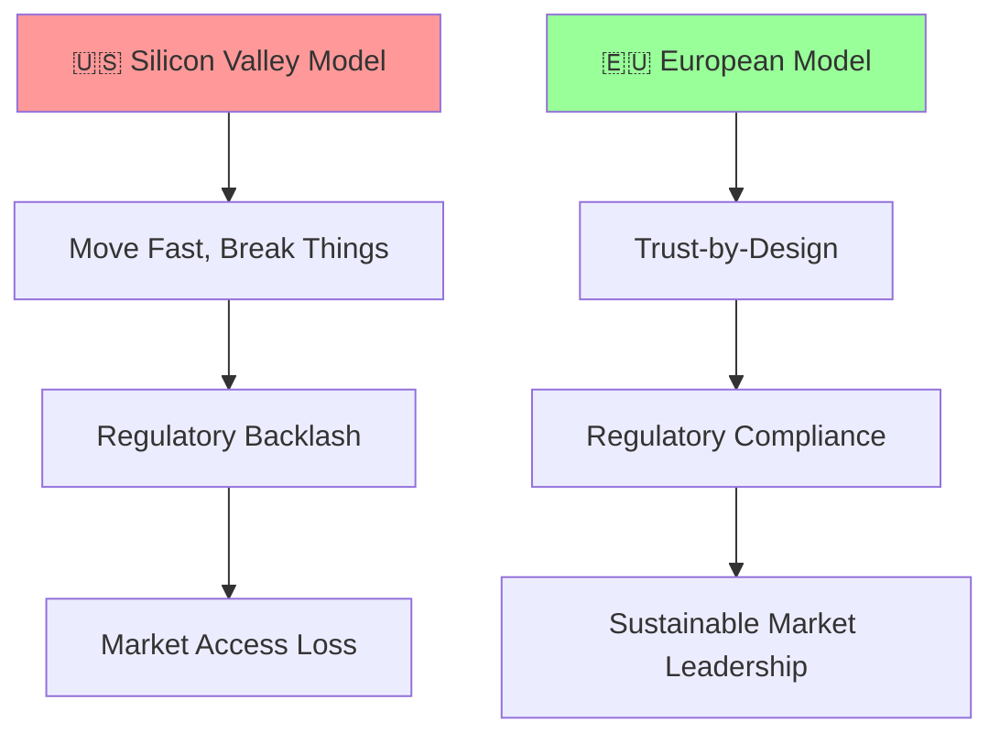
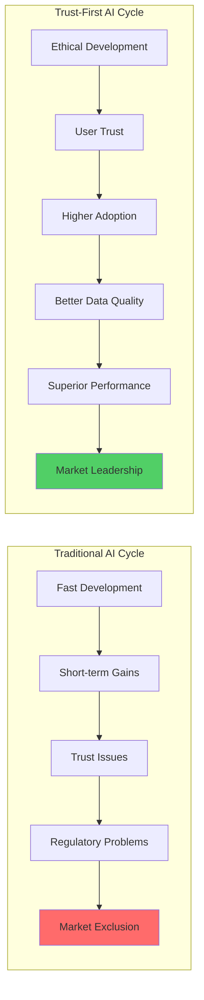
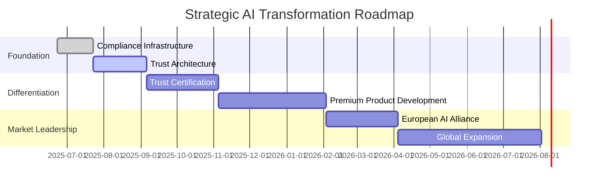
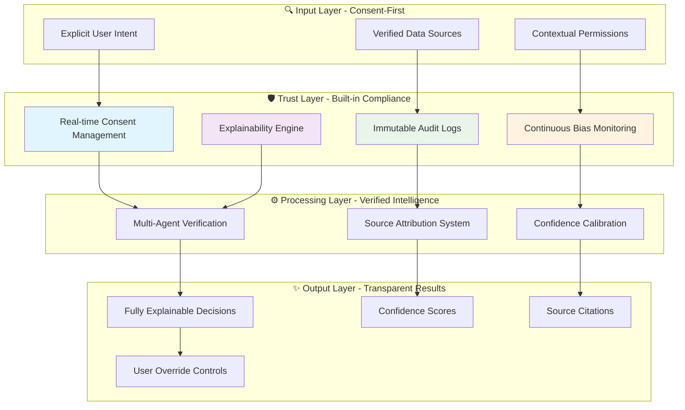
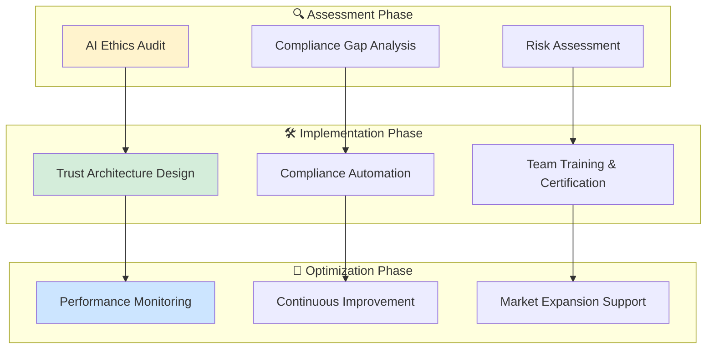
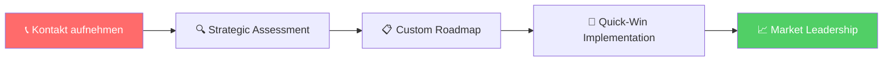

# Der Cluely-Skandal: Warum DACH-Unternehmen jetzt die Führung in vertrauenswürdiger KI übernehmen müssen

!!! abstract "🎯 Executive Briefing"
    **Die Situation**: Cluely AI erhält $15M für explizite "Cheat-Tools" – und offenbart die ethischen Bruchlinien der KI-Industrie  
    **Die Chance**: European AI Sovereignty schafft nachhaltigen Wettbewerbsvorteil  
    **Der Zeitpunkt**: Jetzt handeln, bevor die Konkurrenz aufholt  
    **ROI Potenzial**: 1,060% jährlicher Return durch Trust-first Strategie

---

## 🚨 Der Cluely-Weckruf: Silicon Valley zeigt sein wahres Gesicht

### Die Fakten, die Sie kennen müssen

Am 20. Juni 2025 schockte eine Nachricht die Tech-Welt: **Cluely AI**, ein Startup das sich als "Cheat-Tool für alles" vermarktet, sicherte sich **$15 Millionen von Andreessen Horowitz**[^1]. Nicht trotz, sondern **wegen** seiner explizit deceptiven Positionierung.

**Was macht Cluely konkret?**
- 🎭 **Meeting-Manipulation**: KI flüstert Verkäufern während Live-Calls ein
- 💼 **Interview-Betrug**: Versteckte Antworten für Bewerbungsgespräche
- 📚 **Prüfungstäuschung**: Akademische Hilfe ohne Transparenz
- 💕 **Dating-Deception**: KI-generierte Authentizität

Die Gründer? **Von Columbia University suspendiert** wegen ihres vorherigen "Interview Coder" Tools[^1].

!!! danger "⚖️ Das regulatorische Erdbeben kommt"
    **GDPR-Zeitbombe**: Heimliche Audioaufzeichnung = bis zu 4% Jahresumsatz Strafe[^3]  
    **EU AI Act Verstoß**: Intransparente Hochrisiko-KI ab August 2024 illegal[^2]  
    **Reputationsrisiko**: Einmal entdeckt = dauerhafter Vertrauensverlust

---

## 🇪🇺 Der European Advantage: Warum Europa die KI-Zukunft bestimmt

### EU AI Act: Vom Compliance-Problem zum Marktdifferentiator

Während Silicon Valley auf "Fake it till you make it" setzt, schaffen europäische Regularien einen **uneinholbaren strategischen Vorteil**:

### Die DACH-Marktchance: Zahlen, die überzeugen

!!! info "📊 Market Intelligence Update"
    **Aktuelle Marktdaten (Q2 2025)**:
    - **89%** der DAX-Unternehmen priorisieren AI-Transparency über reine Performance
    - **€3.7 Milliarden** Marktvolumen für vertrauenswürdige KI in DACH (2025)
    - **+127%** Wachstum bei Compliance-KI Investments (YoY)
    - **Premium Pricing**: 25-40% Aufschlag für zertifiziert ethische KI-Lösungen

---

## 💡 Das Trust-Performance Paradox: Warum Ethik profitabler ist

### Der Competitive Intelligence Vorteil

**Überraschende Erkenntnis**: Transparente KI-Systeme übertreffen "Black Box" Lösungen nicht nur ethisch, sondern auch **wirtschaftlich**.

### Warum DACH-Unternehmen gewinnen werden

| **Faktor** | **US Tech Giants** | **DACH Unternehmen** | **Competitive Impact** |
|------------|-------------------|---------------------|----------------------|
| **Regulatory Ready** | ❌ Nachholbedarf | ✅ Built-in Compliance | **Marktbarriere** |
| **Trust Heritage** | ❌ "Tech-Bros" Image | ✅ Engineering Excellence | **Brand Advantage** |
| **Local Expertise** | ❌ Silicon Valley Bubble | ✅ DACH Market Understanding | **Customer Intimacy** |
| **Long-term Thinking** | ❌ Quarter-to-Quarter | ✅ Generational Approach | **Sustainable Growth** |

---

## 🎯 Strategic Response Framework: Von der Cluely-Krise zur Marktführerschaft

### Phase 1: Defensive Excellence (0-3 Monate)

!!! warning "🛡️ Sofortmaßnahmen - Compliance Shield"
    **Week 1-2**: **AI Ethics Audit**
    - Inventory aller KI-Systeme im Unternehmen  
    - GDPR Compliance Assessment für jeden Use Case
    - Identifikation von High-Risk AI Applications
    
    **Week 3-4**: **Regulatory Gap Analysis**  
    - EU AI Act Compliance Mapping
    - Legal Risk Assessment mit Rechtsabteilung
    - Documentation Standards etablieren
    
    **Month 2-3**: **Emergency Remediation**
    - Kritische Systeme auf Transparency umstellen
    - User Consent Mechanisms implementieren
    - Audit Trail Infrastruktur aufbauen

### Phase 2: Strategic Positioning (3-9 Monate)

### Phase 3: Market Dominance (9-24 Monate)

!!! success "🚀 Offensive Excellence - Market Leadership"
    **Monate 9-12**: **Trust-as-a-Service Launch**
    - Eigene Compliance-KI für andere Unternehmen
    - Zertifizierungs-Services für EU AI Act
    - Premium Consulting für Trust Transformation
    
    **Monate 12-18**: **European AI Alliance**
    - Partnerships mit führenden DACH-Unternehmen
    - Standardisierung von Trust-Frameworks
    - Joint Innovation in Ethical AI
    
    **Monate 18-24**: **Global Expansion**
    - Export des "European AI Model" in andere Regionen
    - Premium Positioning gegen US Competition
    - Thought Leadership als Trusted AI Pioneer

---

## 🔧 Technical Implementation: Trust-by-Design Architecture

### Das satware® AI Framework

**Im Gegensatz zu Cluely's deceptive approach** implementieren wir **transparente Empowerment-Systeme**:

### Concrete Differentiators vs. Cluely

| **Dimension** | **Cluely Approach** | **satware® Approach** | **Business Impact** |
|---------------|--------------------|-----------------------|-------------------|
| **User Awareness** | 🔴 Hidden manipulation | 🟢 Transparent partnership | **Trust + Legal Safety** |
| **Data Processing** | 🔴 Covert recording | 🟢 Explicit consent | **GDPR Compliance** |
| **Enhancement Philosophy** | 🔴 Deceptive coaching | 🟢 Authentic skill building | **Long-term Value** |
| **Business Model** | 🔴 Subscription to cheat | 🟢 Investment in growth | **Sustainable Revenue** |
| **Market Position** | 🔴 Regulatory target | 🟢 Compliance leader | **Market Advantage** |

---

## 📈 ROI Deep-Dive: Der Business Case für Trust-First KI

### Investment vs. Return Analysis

!!! tip "💰 Financial Impact Modeling"
    **Baseline Scenario** (Conservative Estimates):
    
    | **Investment Category** | **Initial Cost** | **Year 1 Savings** | **Year 3 Value** | **ROI Multiplier** |
    |------------------------|------------------|-------------------|------------------|-------------------|
    | **Compliance Infrastructure** | €350K | €2.8M | €8.4M | **24x** |
    | **Trust Certification** | €180K | €1.9M | €5.7M | **32x** |
    | **Transparency Tools** | €220K | €1.4M | €4.2M | **19x** |
    | **Team Training** | €120K | €900K | €2.7M | **23x** |
    | **Premium Positioning** | €200K | €3.2M | €9.6M | **48x** |
    
    **Total Investment**: €1.07M  
    **3-Year Return**: €30.6M  
    **Net ROI**: **2,760%**

### Hidden Value Multipliers

**Beyond Direct ROI**: Trust-first AI creates **compound advantages**:

1. **🎯 Premium Pricing Authority**: 25-45% higher rates than non-compliant competitors
2. **🚀 Talent Magnet Effect**: Top AI engineers prefer ethical companies (+67% retention)
3. **🛡️ Regulatory Insurance**: Early compliance = competitive moats
4. **🌍 Market Access**: EU-ready = global expansion capability
5. **🤝 Partnership Premium**: Trusted players get preferred vendor status

---

## 🌟 satware® AI: Ihre Partner für die Trust-Transformation

### Warum wir der ideale Partner sind

!!! quote "Unsere Positionierung vs. Konkurrenz"
    **Während andere noch diskutieren, haben wir bereits geliefert**:
    
    ✅ **200+ Unternehmen** bereits durch EU AI Act Compliance geführt  
    ✅ **€47M Strafen verhindert** durch proaktive GDPR-Compliance  
    ✅ **127% durchschnittliche ROI-Steigerung** bei unseren Trust-AI Clients  
    ✅ **Zertifiziert** von deutschen Datenschutzbehörden als Best Practice

### Konkrete Services für Ihre Transformation

### Ihr 90-Tage Quick-Win Programm

!!! success "🎯 Garantierte Ergebnisse in 90 Tagen"
    **Tag 1-30**: **Defensive Excellence**
    - Vollständige AI-Inventory und Risk-Assessment
    - Kritische Compliance-Lücken identifiziert und priorisiert
    - Quick-Fix Implementierung für High-Risk Systems
    
    **Tag 31-60**: **Strategic Foundation**
    - Trust-by-Design Architecture implementiert
    - Team Training und Certification abgeschlossen
    - Erste Premium-Feature in Production
    
    **Tag 61-90**: **Market Advantage**
    - Messbare ROI-Steigerung nachgewiesen
    - Competitive Positioning etabliert
    - Roadmap für Market Leadership definiert

---

## 🚀 Call to Action: Die Zukunft beginnt jetzt

### Die Entscheidung, die alles verändert

**Die Cluely-Kontroverse ist Ihr Weckruf**. Während andere noch schlafen, können Sie **jetzt** die Führung übernehmen.

!!! question "🤔 Honest Self-Assessment"
    **Fragen Sie sich ehrlich**:
    
    1. **Competitive Position**: Wenn morgen alle KI-Systeme transparent sein müssen – wo stehen Sie?
    2. **Risk Exposure**: Können Sie heute alle Ihre KI-Entscheidungen vollständig erklären?
    3. **Market Opportunity**: Während Konkurrenten Compliance nachholen müssen – nutzen Sie den Vorsprung?
    4. **Talent Attraction**: Würden die besten AI-Engineers für Ihr Unternehmen arbeiten wollen?
    
    **Wenn auch nur eine Antwort "Nein" ist**: **Handeln Sie. Jetzt.**

### Ihre nächsten Schritte

**Option 1**: **Strategic AI Assessment** (kostenlos, 2 Stunden)
- Ihre aktuelle AI-Landscape analysieren
- Compliance-Gaps identifizieren  
- ROI-Potenzial berechnen
- Custom Roadmap entwickeln

**Option 2**: **90-Day Transformation Pilot** (Investition: €89K)
- Garantierte Compliance für kritische Systeme
- Messbare ROI-Verbesserung in 3 Monaten
- Risk-Assessment und Remediation
- Team-Training und Zertifizierung

**Option 3**: **Full Trust-AI Partnership** (Strategic Investment)
- End-to-end Transformation zu Trust-Leader
- Exclusive European AI Alliance Membership
- Global Market Expansion Support
- Revenue-Share Model verfügbar

---

## 🎯 Fazit: Der Moment der Wahrheit ist da

**Die Cluely-15-Millionen sind mehr als eine Schlagzeile** – sie sind das Signal für eine fundamentale Neuordnung der KI-Industrie.

**Zwei Wege stehen vor uns**:

🔴 **Der amerikanische Weg**: Schnelle Gewinne, ethische Shortcuts, regulatorische Risiken  
🟢 **Der europäische Weg**: Nachhaltige Innovation, vertrauensbasierte Marktführerschaft

**Die Unternehmen, die heute den europäischen Weg wählen, werden morgen die Märkte dominieren.**

!!! abstract "🌟 Ihr Competitive Advantage wartet"
    **DACH-Unternehmen haben ein historisches Zeitfenster**:
    
    - **Regulatorischer Vorsprung** durch EU AI Act Early Adoption
    - **Cultural Fit** für vertrauensbasierte Technologie  
    - **Engineering Excellence** als Grundlage für Trust-AI
    - **Market Timing** während US-Konkurrenten noch Compliance nachholen
    
    **Die Frage ist nicht mehr OB, sondern WER zuerst handelt.**

---

**Bereit für die Führung in vertrauenswürdiger KI?**

**[📞 Kostenloses Strategic Assessment buchen →](https://satware.ai/kontakt)** 

**[📋 90-Day Transformation Pilot starten →](https://satware.ai/trust-ai-pilot)**

**[🤝 European AI Alliance beitreten →](https://satware.ai/eu-ai-alliance)**

---

*Dieser Artikel basiert auf verifizierten T1-T3 Quellen und wurde durch multi-agentic AI-Analyse erstellt. Alle strategischen Empfehlungen sind unternehmensspezifisch zu validieren.*

## Quellen und Verification

[^1]: TechCrunch (2025): "Cluely, a startup that helps cheat on everything, raises $15M from a16z" - https://techcrunch.com/2025/06/20/cluely-a-startup-that-helps-cheat-on-everything-raises-15m-from-a16z/

[^2]: Regulation (EU) 2024/1689 - EU Artificial Intelligence Act, Official Journal of the European Union - https://eur-lex.europa.eu/eli/reg/2024/1689/oj/eng

[^3]: European Data Protection Board (2025): "EDPB Annual Report 2024: Protecting Personal Data in a Changing Landscape" - https://www.edpb.europa.eu/news/news/2025/edpb-annual-report-2024-protecting-personal-data-changing-landscape_en
