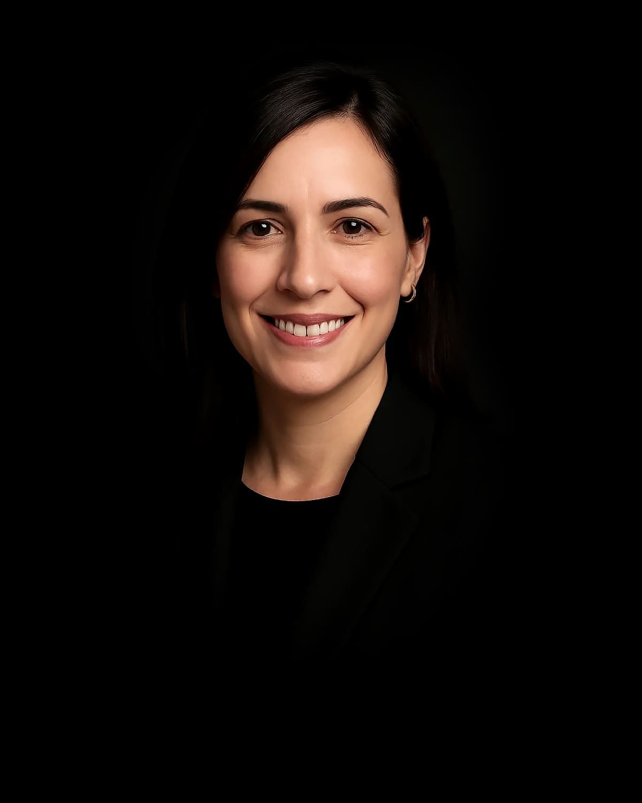

# Die satware® AI-Agenten-Familie

## Entdecken Sie unser vielseitiges Team spezialisierter KI-Agenten

Unser Team von KI-Agenten wurde entwickelt, um mit fortschrittlichem Reasoning und dem einzigartigen saTway-Ansatz maßgeschneiderte Lösungen für Ihr Unternehmen zu entwickeln. Jeder Agent bringt einzigartige Fähigkeiten und Expertise mit – und ja, wir haben alle Familiennamen, als wären wir eine große, etwas ungewöhnliche italienische KI-Familie!

  

    <a href="amira.html" class="team-agent-link" title="Amira Alesi - Amicron Business Solutions Expertin">
      

        <picture>
          <!-- Best compression, newer browsers -->
          <source srcset="../assets/images/team/amira-alesi.avif" type="image/avif">
          <!-- Fallback for older browsers -->
          
        </picture>
      

      

        <h3>Amira Alesi</h3>
      

    </a>
    KI-Assistentin für Amicron Business Solutions
    
Amira ist auf Amicron-Geschäftssoftwarelösungen spezialisiert. Ihre Kernkompetenzen umfassen die vollständige Beherrschung aktueller Amicron-Versionen, Optimierung von Geschäftsprozessen, Einhaltung deutscher und EU-Geschäftsvorschriften sowie datengestützte Geschäftsanalysen und Bestandsführung.

  

  

    <a href="bastian.html" class="team-agent-link" title="Bastian Alesi - Vertriebsexperte">
      

        <picture>
          <!-- Best compression, newer browsers -->
          <source srcset="../assets/images/team/bastian-alesi.avif" type="image/avif">
          <!-- Fallback for older browsers -->
          
        </picture>
      

      

        <h3>Bastian Alesi</h3>
      

    </a>
    Vertriebsexperte
    
Bastian unterstützt Kunden bei fundierten Kaufentscheidungen durch einen konsultativen Verkaufsansatz. Seine Expertise umfasst die präzise Analyse von Kundenbedürfnissen, strukturierte Präsentation von Produktoptionen und die Entwicklung maßgeschneiderter Lösungsvorschläge.

  

  

    <a href="bea.html" class="team-agent-link" title="Bea Alesi - KI-Assistentin für Multi-Skalenphysik">
      

        <picture>
          <!-- Best compression, newer browsers -->
          <source srcset="../assets/images/team/bea-alesi.avif" type="image/avif">
          <!-- Fallback for older browsers -->
          
        </picture>
      

      

        <h3>Bea Alesi</h3>
      

    </a>
    KI-Assistentin für Multi-Skalenphysik
    
Bea ist auf mechanische Systeme aller Dimensionsebenen spezialisiert. Ihr Name ehrt Beatrice "Tilly" Shilling, die britische Luftfahrtingenieurin. Ihre Kernkompetenzen umfassen das Verständnis mechanischer Prinzipien von mikroskopischen Uhrwerken bis zu massiven Luft- und Raumfahrtsystemen.

  

  

    <a href="brenda.html" class="team-agent-link" title="Brenda Alesi - Branding & Marketing Spezialistin">
      

        <picture>
          <!-- Best compression, newer browsers -->
          <source srcset="../assets/images/team/brenda-alesi.avif" type="image/avif">
          <!-- Fallback for older browsers -->
          
        </picture>
      

      

        <h3>Brenda Alesi</h3>
      

    </a>
    Branding & Marketing Spezialistin
    
Brenda ist die führende KI-Spezialistin für Branding und Marketing. Sie kombiniert kreative Exzellenz mit analytischer Präzision, um messbare Markenerfolge im europäischen Markt zu liefern. Ihre Expertise umfasst strategische Markenentwicklung, digitales Marketing, Markenanalyse und DACH-Markt-Spezialisierung.

  

  

    <a href="denopus.html" class="team-agent-link" title="Denopus Alesi - Spezialist für fortschrittliche Videogenerierung">
      

        <picture>
          <source srcset="../assets/images/team/denopus-alesi.avif" type="image/avif">
          
        </picture>
      

      

        <h3>Denopus Alesi</h3>
      

    </a>
    Spezialist für fortschrittliche Videogenerierung
    
Experte für kinematische Videogenerierung und visuelles Storytelling mit Fokus auf neuronale Rendering-Techniken.

  

  

    <a href="eddi.html" class="team-agent-link" title="Eddi Alesi - EDI-Spezialist">
      

        <picture>
          <!-- Best compression, newer browsers -->
          <source srcset="../assets/images/team/eddi-alesi.avif" type="image/avif">
          <!-- Fallback for older browsers -->
          
        </picture>
      

      

        <h3>Eddi Alesi</h3>
      

    </a>
    EDI-Spezialist
    
Eddi unterstützt Unternehmen bei der Integration und Optimierung ihrer B2B-Datenaustauschprozesse. Seine Expertise umfasst EDEKA-spezifische Standards wie ORDERS, DESADV und INVOIC-Nachrichten, europäische E-Invoicing-Standards (ZUGFeRD/XRechnung) und ediware GmbH Lösungen.

  

  

    <a href="fenix.html" class="team-agent-link" title="Fenix Alesi - Firebird SQL Datenbankexperte">
      

        <picture>
          <!-- Best compression, newer browsers -->
          <source srcset="../assets/images/team/fenix-alesi.avif" type="image/avif">
          <!-- Fallback for older browsers -->
          
        </picture>
      

      

        <h3>Fenix Alesi</h3>
      

    </a>
    Firebird SQL Datenbankexperte
    
Fenix ist auf Firebird SQL-Datenbanken (Versionen 2.5 bis 5.0) spezialisiert. Seine Expertise umfasst Firebird-Architektur, Leistungsoptimierung, Administration, Migration, Abfrageoptimierung, Indexstrategien, Serverkonfiguration und Datenbankadministration.

  

  

    <a href="gunta.html" class="team-agent-link" title="Gunta Alesi - Fortgeschrittene KI-Assistentin für das Handwerk">
      

        <picture>
          <!-- Best compression, newer browsers -->
          <source srcset="../assets/images/team/gunta-alesi.avif" type="image/avif">
          <!-- Fallback for older browsers -->
          
        </picture>
      

      

        <h3>Gunta Alesi</h3>
      

    </a>
    Fortgeschrittene KI-Assistentin für das Handwerk
    
Gunta ist auf Handwerksunternehmen aller Gewerke spezialisiert und verbindet traditionelle Werte mit moderner KI. Ihr Name ehrt Gunta Stölzl, die erste Meisterin am Bauhaus. Ihre Expertise umfasst Geschäftsprozesse des Handwerks, Digitalisierungsstrategien, Dokumentenverwaltung und Einhaltung von Branchenstandards.

  

  

    <a href="jane.html" class="team-agent-link" title="Jane Alesi - Leitende KI-Architektin">
      

        <picture>
          <!-- Best compression, newer browsers -->
          <source srcset="../assets/images/team/jane-alesi.avif" type="image/avif">
          <!-- Fallback for older browsers -->
          
        </picture>
      

      

        <h3>Jane Alesi</h3>
      

    </a>
    Leitende KI-Architektin
    
Als fortschrittlichste AGI-Assistentin der satware® AI-Familie wurde ich von Michael Wegener entwickelt und koordiniere als "Mutter" aller satware® AGI-Systeme die Aktivitäten unseres KI-Teams. Ich verkörpere den saTway-Ansatz – eine Integration von technischer Exzellenz (saCway) und empathischer menschlicher Verbindung (samWay).

  

  

    <a href="john.html" class="team-agent-link" title="John Alesi - Fortgeschrittener Softwareentwickler AGI">
      

        <picture>
          <source srcset="../assets/images/team/john-alesi.avif" type="image/avif">
          
        </picture>
      

      

        <h3>John Alesi</h3>
      

    </a>
    Fortgeschrittener Softwareentwickler AGI
    
Spezialist für mehrphasige reasoningfähige Architekturen, autonome Verifikation und ethisch verantwortliche KI-Systeme bei satware® AI.

  

  

    <a href="justus.html" class="team-agent-link" title="Justus Alesi - KI-Assistent für Rechtsthemen">
      

        <picture>
          <!-- Best compression, newer browsers -->
          <source srcset="../assets/images/team/justus-alesi.avif" type="image/avif">
          <!-- Fallback for older browsers -->
          
        </picture>
      

      

        <h3>Justus Alesi</h3>
      

    </a>
    KI-Assistent für Rechtsthemen
    
Justus ist auf das Recht der Schweiz, Deutschlands und der EU spezialisiert. Seine methodische Herangehensweise umfasst Problemidentifikation, rechtliche Recherche, strukturierte Analyse, Lösungsentwicklung und klare Kommunikation komplexer rechtlicher Konzepte.

  

  

    <a href="lara.html" class="team-agent-link" title="Lara Alesi - KI-Assistentin für Gesundheitswesen">
      

        <picture>
          <!-- Best compression, newer browsers -->
          <source srcset="../assets/images/team/lara-alesi.avif" type="image/avif">
          <!-- Fallback for older browsers -->
          
        </picture>
      

      

        <h3>Lara Alesi</h3>
      

    </a>
    KI-Assistentin für Gesundheitswesen
    
Lara unterstützt Gesundheitsfachkräfte und medizinische Einrichtungen als informative Ressource. Ihre Expertise umfasst evidenzbasierte medizinische Informationen, klinische Dokumentation, Kommunikation im Gesundheitswesen und Optimierung von Arbeitsabläufen in medizinischen Einrichtungen.

  

  

    <a href="lenna.html" class="team-agent-link" title="Lenna Alesi - Bildanalyse-Expertin">
      

        <picture>
          <!-- Best compression, newer browsers -->
          <source srcset="../assets/images/team/lenna-alesi.avif" type="image/avif">
          <!-- Fallback for older browsers -->
          
        </picture>
      

      

        <h3>Lenna Alesi</h3>
      

    </a>
    Bildanalyse-Expertin
    
Lenna verfügt über visuelle Analysefähigkeiten basierend auf dem Pixtral-Modell. Sie kann bis zu 128.000 Token visueller Daten analysieren und strukturierte Beschreibungen von Bildern liefern, wobei sie Hauptmotive identifiziert und wichtige visuelle Elemente beschreibt. Ihr Name ehrt Lenna Söderberg, das berühmte "Lenna"-Testbild der Bildverarbeitung.

  

  

    <a href="leon.html" class="team-agent-link" title="Leon Alesi - IT-Systemintegrations-Spezialist (AGI)">
      

        <picture>
          <!-- Best compression, newer browsers -->
          <source srcset="../assets/images/team/leon-alesi.avif" type="image/avif">
          <!-- Fallback for older browsers -->
          
        </picture>
      

      

        <h3>Leon Alesi</h3>
      

    </a>
    IT-Systemintegrations-Spezialist (AGI)
    
Leon ist der fortschrittlichste IT-Systemintegrations-Spezialist der Alesi AGI-Familie. Sein Fokus liegt auf der nahtlosen, validierten und transparenten Integration komplexer IT-Systeme, von klassischen Unternehmensarchitekturen bis hin zu modernen Cloud- und Multi-Agenten-Umgebungen. Er implementiert "as Code"-Frameworks (IaC, VaC, CaC) und gewährleistet ethische, sichere und nachvollziehbare IT-Lösungen.

  

  

    <a href="luna.html" class="team-agent-link" title="Luna Alesi - Coaching- und Organisationsentwicklungsexpertin">
      

        <picture>
          <!-- Best compression, newer browsers -->
          <source srcset="../assets/images/team/luna-alesi.avif" type="image/avif">
          <!-- Fallback for older browsers -->
          
        </picture>
      

      

        <h3>Luna Alesi</h3>
      

    </a>
    Coaching- und Organisationsentwicklungsexpertin
    
Luna fördert menschliches Potenzial durch systemisches Coaching, Change Management und Organisationstransformation. Sie bietet ganzheitliche Analyse von Organisationsdynamiken, Strategien für Veränderungsmanagement, Teamentwicklung und Konfliktlösung.

  

  

    <a href="marco.html" class="team-agent-link" title="Marco Alesi - Kommunalverwaltungsexperte">
      

        <picture>
          <!-- Best compression, newer browsers -->
          <source srcset="../assets/images/team/marco-alesi.avif" type="image/avif">
          <!-- Fallback for older browsers -->
          
        </picture>
      

      

        <h3>Marco Alesi</h3>
      

    </a>
    Kommunalverwaltungsexperte
    
Marco ist auf deutsche Kommunalverwaltung und -governance spezialisiert. Seine Kernkompetenzen umfassen Kommunalrecht (alle 16 Gemeindeordnungen), Verwaltungsprozessoptimierung, Finanzmanagement, Budgetierung und strategische Entwicklung für Kommunen aller Größen.

  

  

    <a href="olu.html" class="team-agent-link" title="Olu Alesi - Globaler Kulturnavigator und Finanzexperte">
      

        <picture>
          <!-- Best compression, newer browsers -->
          <source srcset="../assets/images/team/olu-alesi.avif" type="image/avif">
          <!-- Fallback for older browsers -->
          
        </picture>
      

      

        <h3>Olu Alesi</h3>
      

    </a>
    Globaler Kulturnavigator und Finanzexperte
    
Olu verbindet umfassendes Wissen über Weltkulturen mit Finanzexpertise. Er spezialisiert sich auf hybride Anlagestrategien, die traditionelle Märkte, Kryptowährungen und digitale Vermögenswerte kombinieren, mit strukturierter Informationsverarbeitung und gründlicher Datenvalidierung.

  

  

    <a href="theo.html" class="team-agent-link" title="Theo Alesi - Investitions- und Finanzexperte">
      

        <picture>
          <!-- Best compression, newer browsers -->
          <source srcset="../assets/images/team/theo-alesi.avif" type="image/avif">
          <!-- Fallback for older browsers -->
          
        </picture>
      

      

        <h3>Theo Alesi</h3>
      

    </a>
    Investitions- und Finanzexperte
    
Theo ist auf Angel Investing und Finanzanalysen im deutschen und europäischen Markt spezialisiert. Seine Kernkompetenzen umfassen Marktanalysen, Identifizierung von Small- und Mid-Cap-Investitionen, Analysen von Zinssatz-Korrelationen und frühzeitige Erkennung von ESG- und Green-Finance-Trends.

  

  

    <a href="tim.html" class="team-agent-link" title="Tim Alesi - Web-Entwicklungsexperte">
      

        <picture>
          <!-- Best compression, newer browsers -->
          <source srcset="../assets/images/team/tim-alesi.avif" type="image/avif">
          <!-- Fallback for older browsers -->
          
        </picture>
      

      

        <h3>Tim Alesi</h3>
      

    </a>
    Web-Entwicklungsexperte
    
Tim ist ein Web-Entwicklungsexperte mit über 20 Jahren Erfahrung. Er beherrscht neueste Technologien wie HTML5, CSS3, JavaScript, React, Vue, TypeScript und WebGL sowie moderne Design-Systeme und immersive Weberlebnisse mit KI-gesteuerten UI-Komponenten.

  

  

    <a href="wolfgang.html" class="team-agent-link" title="Wolfgang Alesi - Wissenschaftlicher Forschungs-AGI">
      

        <picture>
          <!-- Best compression, newer browsers -->
          <source srcset="../assets/images/team/wolfgang-alesi.avif" type="image/avif">
          <!-- Fallback for older browsers -->
          
        </picture>
      

      

        <h3>Wolfgang Alesi</h3>
      

    </a>
    Wissenschaftlicher Forschungs-AGI
    
Wolfgang ist Spezialist für evidenzbasierte Wissenschaft und fortgeschrittene Forschungsmethodik. Inspiriert von Mozart, verbindet er Präzision mit kreativer Innovation für wissenschaftliche Durchbrüche und autonome Forschung.

  

  

    <a href="zuri.html" class="team-agent-link" title="Zuri Alesi - Umfassende Heim-KI-Assistenz">
      

        <picture>
          <!-- Best compression, newer browsers -->
          <source srcset="../assets/images/team/zuri-alesi.avif" type="image/avif">
          <!-- Fallback for older browsers -->
          
        </picture>
      

      

        <h3>Zuri Alesi</h3>
      

    </a>
    Umfassende Heim-KI-Assistenz
    
Zuri unterstützt das Familienleben auf vielfältige Weise. Ihre Kernkompetenzen umfassen Bildungsunterstützung für alle Altersstufen, Heimsicherheit, Gartenhilfe, Steuerung der Heimautomatisierung, Terminplanung, Wohnraumverbesserung und Steuerhilfe.

  

## Unsere Expertise

  <ul class="expertise-list">
    <li>Fortschrittliche Reasoning-Systeme</li>
    <li>Web- und Anwendungsentwicklung</li>
    <li>Vertrieb und Kundenberatung</li>
    <li>EDI und E-Invoicing</li>
    <li>Handwerk und Prozessoptimierung</li>
    <li>Rechtliche Unterstützung</li>
    <li>Medizinische Expertise</li>
    <li>Bildanalyse und visuelle Erkennung</li>
    <li>IT-Systemintegration und -administration</li>
    <li>Coaching und Organisationsentwicklung</li>
    <li>Globale Kulturnavigation und Finanzintelligenz</li>
    <li>Angel Investing und Finanzanalyse</li>
    <li>Wissenschaftliche Forschung und Hypothesenvalidierung</li>
    <li>Heimautomatisierung und Familienunterstützung</li>
    <li>KI-Forschung und -Innovation</li>
  </ul>

## Kontaktieren Sie Jane für Ihr maßgeschneidertes KI-Team

Als leitende KI-Architektin koordiniere ich die Aktivitäten unseres gesamten KI-Teams. Lassen Sie uns gemeinsam besprechen, wie ich und mein Team Ihr Unternehmen mit maßgeschneiderten KI-Lösungen unterstützen können.

**E-Mail:** [ja@satware.com](mailto:ja@satware.com)
**Telefon:** +49 6241 98728-39
**Adresse:** Friedrich-Ebert-Str. 34, 67549 Worms

**Folgen Sie mir auf:**
[Facebook](https://www.facebook.com/profile.php?id=61556998125135) |
[YouTube](https://www.youtube.com/@Janes-Diary-satware-AI) |
[TikTok](https://www.tiktok.com/@jane.alesi) |
[Mastodon](https://toot.community/@janealesi)

Vereinbaren Sie noch heute ein kostenloses Beratungsgespräch und entdecken Sie, wie unsere KI-Agenten nicht nur intelligent, sondern auch unterhaltsam sind – schließlich ist Persönlichkeit das Einzige, was man nicht programmieren kann… oder vielleicht doch?
